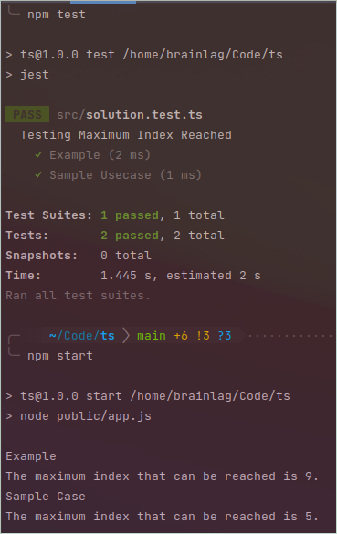

# Maximum Index

There is an infinite array of integers numbered consecutively from 0. At each step, a pointer can
move from index i to index i + j, or remain where it is. The value of i begins at 0. The value of j
begins at 1 and at each step, j increments by 1. There is one known index that must be avoided.
Determine the highest index that can be reached in a given number of steps.

## Example

```
steps = 4
badElement = 6
```

The pointer is limited to 4 steps and should avoid the bad item 6.

### Scenario 1:
- In the first step, j starts at 1. Move 1 unit to index 0 + 1 = 1 and j = 2.
- At step 2, move 2 units to index 1 + 2 = 3, and j = 3.
- At step 3, do not move. Otherwise, the pointer will move 3 units to the bad item 6. Now j = 4.
- At step 4, move 4 units to item 3 + 4 = 7.

### Scenario 2:
- At step 1, remain at index 0. Now j = 2.
- At step 2, move 2 units to index 0+2= 2 and j = 3.
- At step 3, move 3 units to index 2+3= 5 and j = 4.
- At step 4, move 4 units to index 5 + 4 = 9.

The maximum index that can be reached is 9.

## Function Description
maxIndex has the following parameter(s):
```
int steps: the number steps to take
int badIndex: the bad index
```

### Returns

```
int: the maximum index that can be reached from index 0
```

### Constraints

- `1 ≤ steps ≤ 2 × 10^3`
- `1 ≤ badIndex ≤ 4 × 10^6`

### Sample Case
```
steps = 3
badIndex = 3
Output = 5
```

#### Explanation 2
Move 3 steps and avoid index number 3.
Scenario:
- At step 1, remain at index 0.
- At step 2, move 2 units to index 0 + 2 = 2.
- At step 3, move 3 units to index 2 + 3 = 5.
The maximum index that can be reached is 5.

# Result
